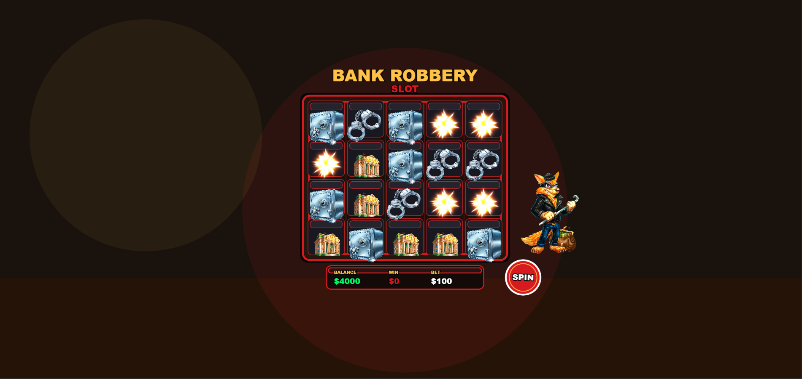

# bank robbery slot challenge

desafio técnico desenvolvido utilizando pixijs.

## tecnologias

- pixijs v7
- pixi-spine
- vite
- javascript

## funcionalidades

- layout de slot 5x4
- símbolos animados com spine
- sistema de spin
- popup de vitória e derrota
- efeitos de explosão
- hud animada
- interface responsiva
- elementos com animação

## assets e referências

todos os assets utilizados no projeto foram fornecidos junto ao desafio técnico.

a implementação visual, animações, fluxo de interação e estrutura geral foram desenvolvidos com base no vídeo e nos materiais de referência disponibilizados no desafio, utilizando pixijs e spine para recriar uma experiência semelhante através de implementação própria.

## executar localmente

```bash
npm install
npm run dev
```

## build de produção

```bash
npm run build
```

## preview da build

```bash
npm run preview
```

## observações

projeto desenvolvido como parte de um desafio técnico com foco em recriar a interface e o fluxo de interação de um jogo estilo slot utilizando pixijs, seguindo os assets e referências fornecidos nos materiais do desafio.

## preview

